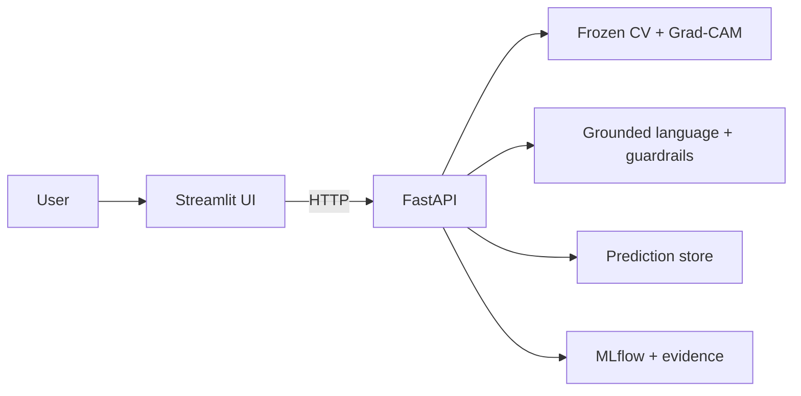

<!-- Managed by Notebook 9 -->
# API-Driven Chest X-Ray Analysis and Explanation Assistant using ChestMNIST

An educational decision-support prototype that combines a frozen ResNet-18 ChestMNIST multilabel classifier, Grad-CAM visual evidence, grounded FLAN-T5 language generation, a versioned FastAPI backend, and a Streamlit interface.

> **Educational-use limitation:** This output is generated by an educational decision-support prototype. It is not a diagnosis and should not replace review by a qualified healthcare professional.

## Solution workflow

1. Validate and decode a PNG or JPEG image.
2. Run frozen multilabel classification and compare frozen per-label thresholds.
3. Produce cautious no-target or crossed-finding interpretation.
4. Generate Grad-CAM evidence only for crossed findings.
5. Generate structured, grounded language outputs and guarded follow-up answers.
6. Deliver the workflow through FastAPI and an HTTP-only Streamlit interface.
7. Preserve model, prompt, API, UI, test, and operational lineage in MLflow and checksum registries.

## Architecture



The Streamlit container never imports or loads the computer-vision model, language model, Grad-CAM service, guardrail, or prediction store.

## Quick start with Docker Compose

```bash
cp .env.example .env
docker compose build
docker compose up -d
python deployment/validate_services.py
```

- Streamlit: `http://127.0.0.1:8501`
- FastAPI health: `http://127.0.0.1:8000/health`
- OpenAPI: `http://127.0.0.1:8000/docs`

The host data root must already contain the persisted models, caches, contracts, thresholds, prompt registry, MLflow tracking store, and output evidence produced by Notebooks 1–8.

## Repository structure

- `api/` — FastAPI routes, schemas, configuration, and application factory
- `ui/` — Streamlit application, components, and HTTP client
- `src/` — frozen model, language, explainability, workflow, and guardrail services
- `configs/` — path, model, prompt, API, UI, and runtime contracts
- `tests/` — reusable API and focused interface tests
- `deployment/` — launch scripts and post-deployment validation
- `docs/` — architecture, usage, API, safety, testing, and reproducibility guides
- `reports/` — demonstration inputs and solution evidence

## Documentation

- [Architecture](docs/architecture.md)
- [Usage and deployment](docs/usage.md)
- [API examples](docs/api_examples.md)
- [Safety and limitations](docs/safety_and_limitations.md)
- [Testing, MLflow, and reproducibility](docs/testing_mlflow_reproducibility.md)
- [Demonstration evidence](docs/demonstration_evidence.md)

## Validation boundary

The packaging notebook performs static Docker/Compose validation and preserves the already successful independent FastAPI, Streamlit, client-contract, UI-state, live-workflow, screenshot-readiness, MLflow, and storage evidence. Building or publishing container images is an explicit deployment action and is not performed automatically by the notebook.
