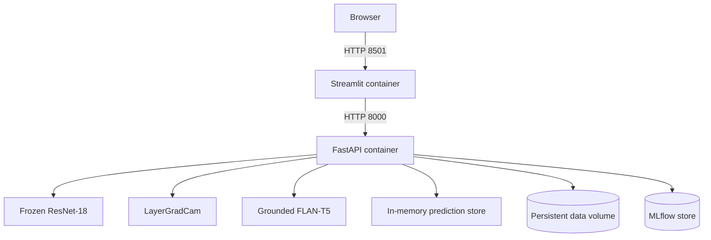
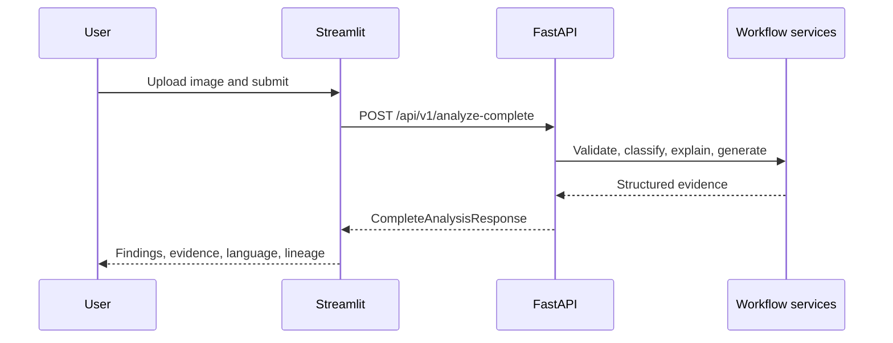

<!-- Managed by Notebook 9 -->
# Solution Architecture

## Runtime topology

## Ownership boundaries

| Component | Owns | Must not own |
|---|---|---|
| Streamlit | upload UX, preview, HTTP requests, rendering, session state | models, thresholds, Grad-CAM, guardrails, prediction storage |
| FastAPI | schemas, validation, workflows, controlled errors, operational metrics | browser session state |
| CV service | frozen probabilities and threshold decisions | clinical interpretation |
| Explainability service | attribution evidence for crossed findings | lesion or anatomical confirmation |
| Language service | evidence-grounded educational text | image inspection or unsupported medical advice |
| Persistent volume | models, caches, MLflow, artifacts, evidence | transient container layers |

## Primary request sequence

## Deployment contracts

- API target: `api.main:app`, port `8000`, health `/health`.
- UI target: `ui/app.py`, port `8501`, health `/_stcore/health`.
- Internal UI-to-API URL: `http://api:8000`.
- Persistent host volume: `/home/jovyan/apicdsa2-datavol-1/chest-xray-ai-assistant-data` mounted at the same container path.
- API requests may use NVIDIA GPU resources; the UI image is CPU-only.
- MLflow tracking URI: `file:///home/jovyan/apicdsa2-datavol-1/chest-xray-ai-assistant-data/mlflow`.

## Safety boundary

Grad-CAM is attribution evidence, not segmentation or confirmation. No-target-finding means that none of the fourteen supported labels crossed its frozen threshold; it does not establish clinical normality. All output requires qualified professional review.
